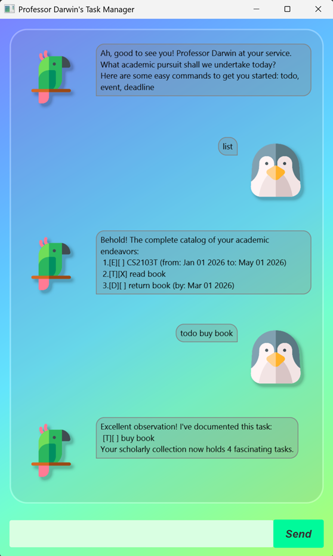

# Darwin's User Guide

---
## Quick Start

---
1. Ensure you have Java `17` or above installed in your Computer.<br>
**Mac users:** Ensure you have the precise JDK version prescribed 
[here](https://se-education.org/guides/tutorials/javaInstallationMac.html).

2. Download the latest `.jar` file from [here]().

3. Copy the file to the folder you want to use as the home folder for your Darwin chatbot.

4. Open a command terminal, `cd` into the folder you put the jar file in, and use the 
`java -jar darwin.jar` command to run the application.<br>
A GUI similar to the below should appear in a few seconds.



---
## Features
- List tasks
- Add tasks (Todos, Deadlines, Events)
- Mark / Unmark tasks as completed 
- Delete tasks 
- Find tasks by keyword

---
### Viewing all tasks: `list`
Shows a list of all tasks in your task tracker.<br>
Format: `list`

---
### Adding a todo task: `todo`


---
### Adding a event task: `todo`


---
### Adding a event task: `todo`


---
### Adding a event task: `todo`


---
### Adding a event task: `todo`


---
### Adding a event task: `todo`


---
### Adding a event task: `todo`


---
### Adding a event task: `todo`


---
### Adding a event task: `todo`


// Describe the action and its outcome.

// Give examples of usage

Example: `keyword (optional arguments)`

// A description of the expected outcome goes here

```
expected output
```

## Feature ABC

// Feature details


## Feature XYZ

// Feature details